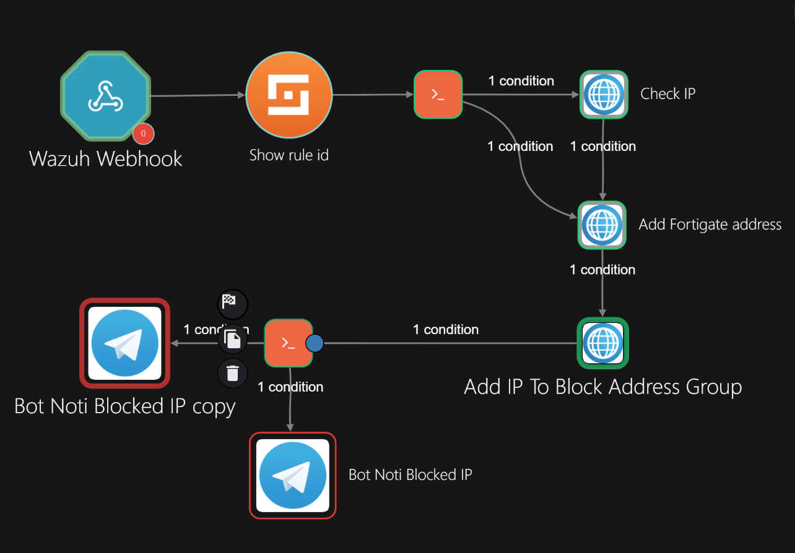

# Incident Response Workflow

## Overview

This document describes the automated incident response workflow built with **Shuffle SOAR**.

The workflow automates the detection, analysis, containment, and notification process by integrating:

- **Wazuh SIEM** for security event detection
- **Shuffle SOAR** for workflow orchestration
- **AbuseIPDB** for threat intelligence enrichment
- **FortiGate Firewall** for automated IP blocking
- **Telegram Bot** for security notification

The main objective is to reduce incident response time and improve SOC operational efficiency.

---

# Workflow Architecture

# Workflow Architecture

```text
                 Wazuh SIEM
                     |
                     |
              Security Alert
                 (JSON)
                     |
                     v
             Shuffle SOAR
                     |
                     v
          Alert Data Processing
                     |
                     v
        Threat Intelligence Lookup
              (AbuseIPDB)
                     |
                     v
            Risk Evaluation
                     |
          +----------+----------+
          |                     |
      High Risk             Low Risk
          |                     |
          v                     v
  FortiGate IP Block       Log Event
          |
          v
 Telegram Notification
```

## Workflow Diagram



---

# Workflow Description

## 1. Alert Ingestion

Wazuh detects suspicious activities and forwards security alerts to Shuffle through a webhook integration.

The alert payload contains information such as:

- Detection rule
- Source IP address
- Event timestamp
- Alert severity

---

## 2. Alert Analysis and Enrichment

Shuffle processes the incoming alert and performs threat intelligence enrichment.

The workflow queries AbuseIPDB to evaluate the reputation of the detected source IP address.

The enrichment result is used as an additional factor for risk assessment.

---

## 3. Risk-Based Decision

The workflow evaluates the threat intelligence result and determines the appropriate response.

Decision logic:

```text
High Risk IP
    |
    +--> Automated Containment


Low Risk IP
    |
    +--> Record Event
```

---

## 4. Automated Containment

For high-risk IP addresses, Shuffle performs an automated response action:

- Creates a blocked IP object on FortiGate
- Adds the IP address to a firewall block group
- Prevents further malicious communication

---

## 5. Incident Notification

After the response action is completed, the workflow sends a notification to the SOC team.

The notification includes:

- Blocked IP address
- Detection information
- Risk assessment result
- Firewall action status

---

# Automation Flow

```text
Detection
    |
    v
Wazuh Alert
    |
    v
SOAR Processing
    |
    v
Threat Intelligence Analysis
    |
    v
Risk Decision
    |
    v
Automated Firewall Response
    |
    v
SOC Notification
```

---

# Workflow Components

| Component | Role |
|-----------|------|
| Wazuh | Security event detection and alert generation |
| Shuffle | SOAR orchestration and automation engine |
| AbuseIPDB | External threat intelligence source |
| FortiGate | Network containment and blocking |
| Telegram | Incident notification channel |

---

# Security Benefits

This automation provides:

- Faster incident response
- Reduced manual SOC workload
- Consistent response actions
- Improved visibility during security incidents
- Standardized incident handling procedures